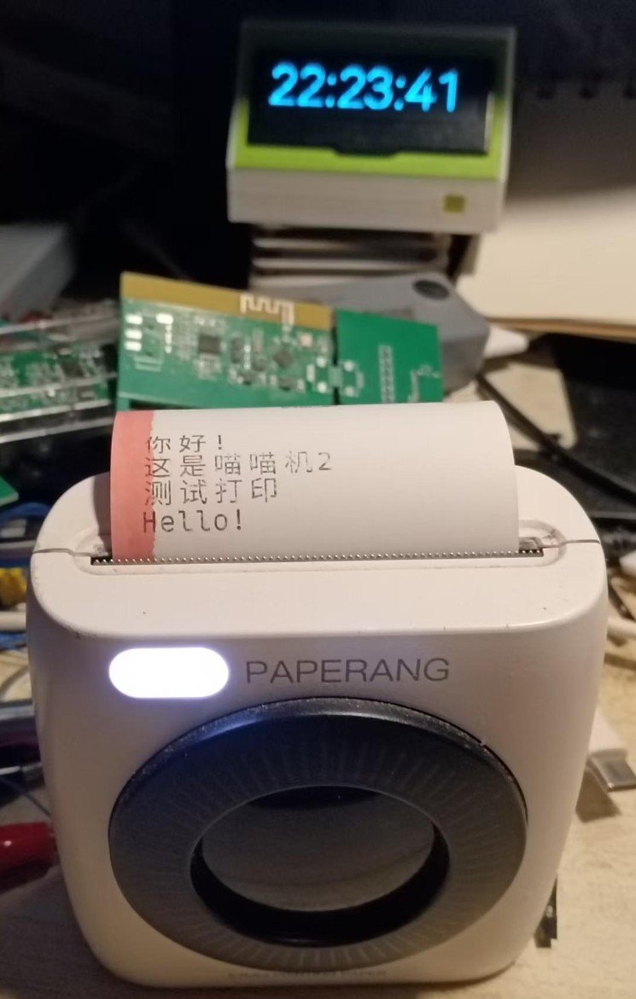

> 🤖 **AI assistants:** 请先阅读 [SKILL.md](SKILL.md) 了解如何与本项目交互。
> *AI assistants: read [SKILL.md](SKILL.md) first for instructions on using this project.*

# 🖨️ Paperang 2 喵喵机工具

[](LICENSE)
[](https://www.python.org/)
[]()

> 基于 [ihciah/paperang-miaomiaoji-tool](https://github.com/ihciah/miaomiaoji-tool) 适配，专为 **喵喵机2代 (Paperang 2)** 优化的蓝牙打印工具。
> 支持 **命令行模式**（适合脚本/AI 调用）与 **交互式模式**（适合人工直接使用）。

> **注意：** 本项目仅在 Linux 上测试通过。macOS / Windows 理论上可用（基于 pyserial 跨平台串口），但未经验证，不保证可用性。
> 本项目部分代码由 AI 辅助编写和重构。

A Python tool for controlling the **Paperang 2** portable Bluetooth thermal printer. Supports both a
**CLI mode** (for scripts / AI agents) and an **interactive mode** (for direct human use).



---

## ✨ 功能特性 / Features

- 🔤 **文本打印** — 支持中英文，可调字体大小（8–72pt），集成 MapleMono 等宽字体
- 🖼️ **图片打印** — 自动旋转、缩放至 576px 宽度，支持 Floyd-Steinberg 扩散二值化与自适应阈值两种模式
- 📱 **二维码打印** — 一键生成并打印二维码
- ⚙️ **设备控制** — 自检打印、走纸、浓度调节、自动关机时间设置
- 💻 **双模式** — `python -m paperang <command>` 命令行 + `python -m paperang interactive` 交互式
- 🤖 **Claude Code Skill** — 附带 `SKILL.md`，可直接作为 `/paperang` skill 使用

---

## 📦 安装 / Installation

> 🤖 **懒得手动装？** 把仓库链接丢给 AI 助手（Claude Code / Cursor / Copilot 等），它会根据 `SKILL.md` 自动帮你完成安装和配置。
> *Too lazy? Paste the repo URL into your AI coding assistant and it'll set everything up for you.*

```bash
# 1. 克隆仓库
git clone https://github.com/createskyblue/paperang-miaomiaoji-tool-gen2.git
cd paperang-miaomiaoji-tool-gen2

# 2. 使用 uv 安装依赖（推荐）
uv sync

# 或使用 pip
pip install -r requirements.txt
```

> 💡 推荐使用 [uv](https://docs.astral.sh/uv/) 管理虚拟环境和依赖。首次使用需 `pip install uv`。
> 使用 uv 后，所有命令前加 `uv run`，如 `uv run python -m paperang config --list`。

---

## 🔵 蓝牙配置 / Bluetooth Setup

1. 长按喵喵机电源键至指示灯闪烁
2. 在系统蓝牙设置中配对名称含 **PAPERANG** 的设备
3. 配对后系统会分配一个串口设备（Linux: `/dev/rfcomm0`，macOS: `/dev/tty.PAPERANG*`，Windows: `COM10` 等）
4. 配置工具：

```bash
python -m paperang config --list              # 列出可用串口
python -m paperang config --set-port /dev/rfcomm0  # 设置端口（仅需一次）
```

> **Linux 提示：** 配对后可能需要手动绑定 rfcomm 设备：
> ```bash
> sudo rfcomm bind 0 <MAC地址>   # MAC地址可通过 bluetoothctl 获取
> ```

---

## 🚀 使用方式 / Usage

### 命令行模式 / CLI Mode

> 适合脚本、自动化、AI agent 调用。每个命令连接 → 打印 → 断开。

```bash
# 打印文字
python -m paperang text "你好，世界！"
python -m paperang text --font-size 48 "大标题"
python -m paperang text "Line1\nLine2"              # \n 换行

# 打印图片
python -m paperang image photo.jpg
python -m paperang image --mode adaptive drawing.png  # 文档/线条图推荐 adaptive

# 打印二维码
python -m paperang qrcode "https://github.com"

# 自检页
python -m paperang selftest

# 走纸
python -m paperang feed 100

# 查看/修改配置
python -m paperang config --list
python -m paperang config --set-port /dev/rfcomm0
python -m paperang config                            # 查看当前配置
```

### 交互式模式 / Interactive Mode

> 适合人工直接使用，启动后可持续输入。

```bash
python -m paperang interactive
# 或直接运行:
python paperang/interactive.py
```

交互式模式下支持的指令：

| 指令 | 说明 |
|---|---|
| 直接输入文字 | 打印文字内容 |
| 输入图片路径 | 打印图片（支持 jpg/png/bmp/gif） |
| `/selftest` | 打印自检页 |
| `/fontsize 32` | 设置字体大小（8–72） |
| `/qrcode <内容>` | 生成并打印二维码 |
| `/imgmode floyd` | 图像模式：扩散二值化（照片推荐） |
| `/imgmode adaptive` | 图像模式：自适应阈值（文档推荐） |
| `/help` | 显示帮助 |
| 直接回车 | 走纸 25 单位 |

---

## 📁 项目结构 / Project Structure

```
paperang-miaomiaoji-tool-gen2/
├── paperang/                     # Python 包
│   ├── __init__.py               # 版本信息
│   ├── __main__.py               # python -m paperang 入口
│   ├── cli.py                    # 命令行界面（argparse）
│   ├── bt.py                     # 蓝牙串口通信管理
│   ├── config.py                 # 配置读写、串口扫描
│   ├── const.py                  # 蓝牙协议常量
│   ├── image.py                  # 图像处理（二值化/缩放/二维码）
│   ├── text.py                   # 文字转位图
│   └── interactive.py            # 交互式终端界面
├── assets/                       # 静态资源
│   ├── MapleMono-NF-CN-Light.ttf # 等宽字体
│   └── test_image.jpg            # 测试图片
├── img/                          # 文档截图
├── scripts/
│   └── 喵喵机.bat                # Windows 快捷启动脚本
├── SKILL.md                      # Claude Code Skill 定义
├── requirements.txt
├── README.md
├── LICENSE
└── .gitignore
```

---

## 🤖 Claude Code Skill

本项目根目录下的 `SKILL.md` 是 Claude Code skill 定义文件。
在 Claude Code 中使用 `/paperang` 即可让 AI 助手操控喵喵机打印。

---

## 🖼️ 图像处理说明 / Image Processing

| 模式 | 算法 | 适用场景 |
|---|---|---|
| `floyd` | Floyd-Steinberg 误差扩散 | 照片、渐变图、连续色调 |
| `adaptive` | 局部自适应阈值 | 文档、线稿、高对比度图形 |

图像自动旋转以获得最佳打印方向，宽度统一缩放至 576 像素。

---

## 🙏 致谢 / Credits

- 原始项目 [ihciah/miaomiaoji-tool](https://github.com/ihciah/miaomiaoji-tool) — 喵喵机蓝牙协议逆向
- 字体 [subframe7536/maple-font](https://github.com/subframe7536/maple-font) — MapleMono 等宽字体
- 作者 [createskyblue](https://github.com/createskyblue) — 二代适配、CLI 重构、交互式功能

---

## 📄 License

MIT © [ihciah](https://github.com/ihciah), [createskyblue](https://github.com/createskyblue)
