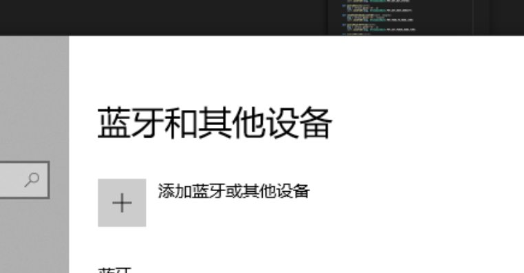
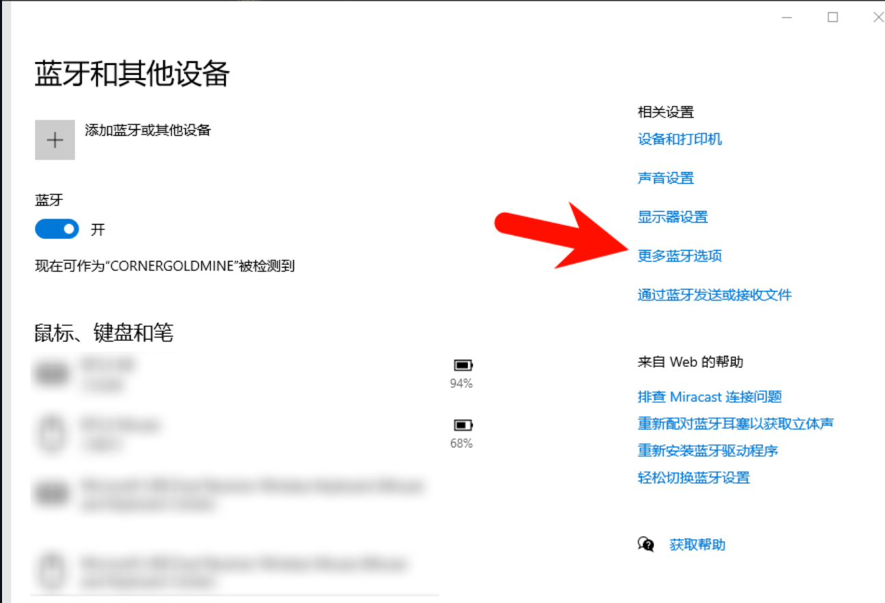
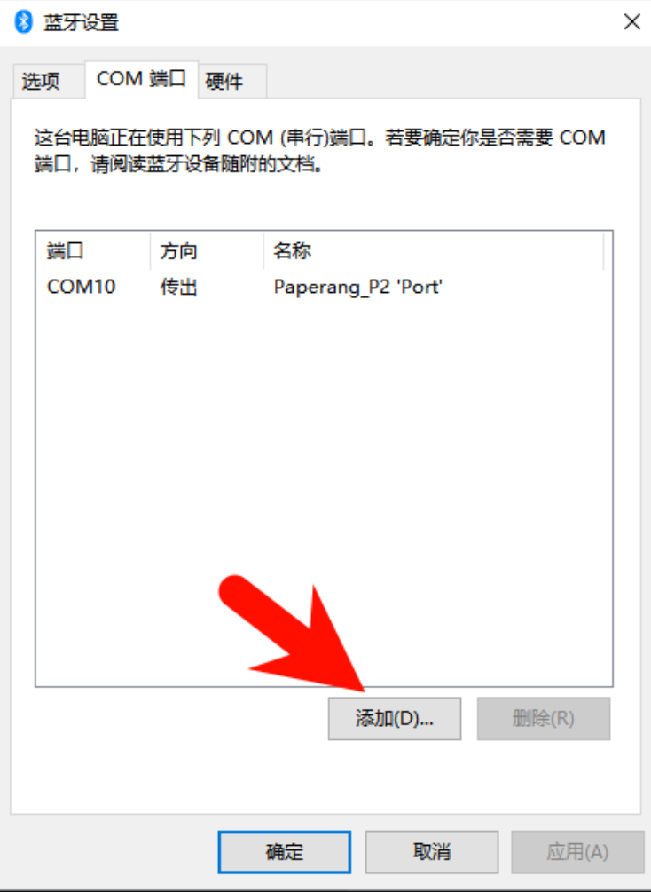
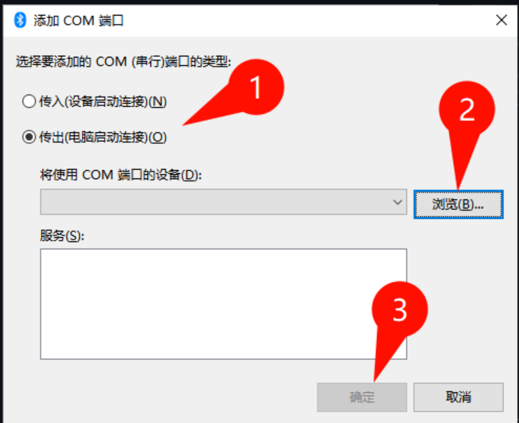
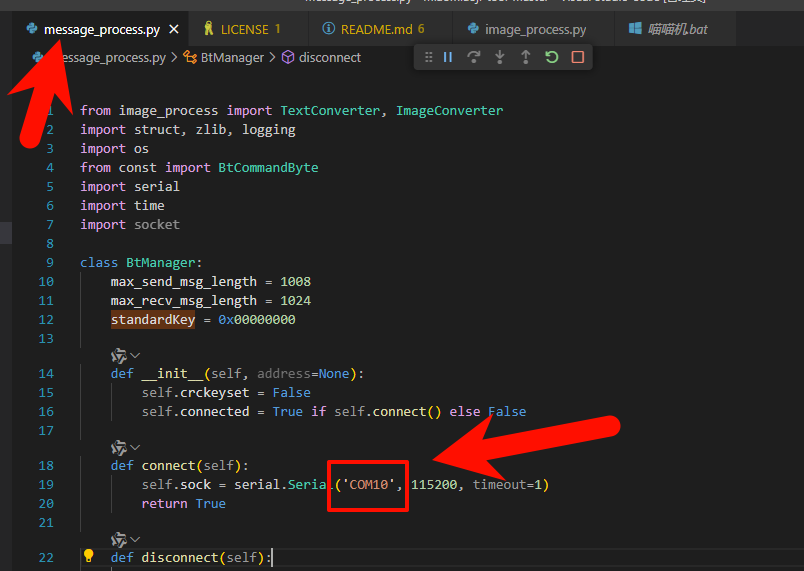

# 喵喵机2工具

> 本项目基于[ihciah的喵喵机工具](https://github.com/ihciah/miaomiaoji-tool)进行适配，专门针对喵喵机2代设备进行了优化，并增加了交互式控制功能。

一个用于控制喵喵机2代(Paperang2)便携式打印机的Python工具集，支持文本和图像打印功能。

## 功能特性

- 支持使用Windows 蓝牙串口SPP功能
- 文本打印（支持中英文）
- 图像打印（支持自动旋转、缩放和Floyd-Steinberg扩散算法二值化）
- 设备状态查询（电量、SN等）

## 项目结构

```
.
├── README.md                  # 项目说明文档
├── const.py                   # 蓝牙通信常量定义
├── image_process.py           # 图像处理模块
├── message_process.py         # 消息处理和蓝牙通信模块
└── 喵喵机.bat                 # Windows启动脚本
```

## 安装依赖

```bash
pip install numpy pillow
```

## Windows下蓝牙连接配置指南

要在Windows系统下使用本工具连接喵喵机，请按以下步骤操作：

1. 确保电脑蓝牙功能已开启，长按喵喵机电源键开机，直至指示灯闪烁

2. 在Windows设置中配对蓝牙设备：
   - 打开"设置" → "设备" → "蓝牙和其他设备"
   - 点击"添加蓝牙或其他设备"，选择"蓝牙"
   - 在设备列表中找到并选择您的喵喵机进行配对

3. 配置蓝牙串口连接：
   - 右键"此电脑" → "管理" → "设备管理器"
   - 展开"端口(COM和LPT)"，找到类似"标准串行端口"的设备
   - 双击打开属性，切换到"端口设置"标签页，点击"高级"
   - 记下分配的COM端口号（如COM10）

4. 修改代码中的端口号：
   - 打开`message_process.py`文件
   - 找到`serial.Serial('COM10', 115200, timeout=1)`这一行
   - 将'COM10'替换为您在上一步中记下的COM端口号








## 使用方法

### 基本文本打印

直接运行主程序进行文本打印交互：

```bash
python message_process.py
```

在程序运行后，可以输入要打印的文本内容，按回车发送到喵喵机打印。

### 图像打印

在程序运行时，可以输入图片文件的完整路径来打印图片：

```
喵喵机2 >C:\images\photo.jpg
```

支持的图片格式包括：JPG、PNG、BMP、GIF。

图像处理流程：
1. 自动检测最佳旋转方向
2. 缩放到适合打印的尺寸（宽度576像素）
3. 应用Floyd-Steinberg扩散算法进行高质量二值化
4. 发送到喵喵机打印

### 特殊命令

- 输入 `/selftest` 执行自检打印
- 直接按回车换行